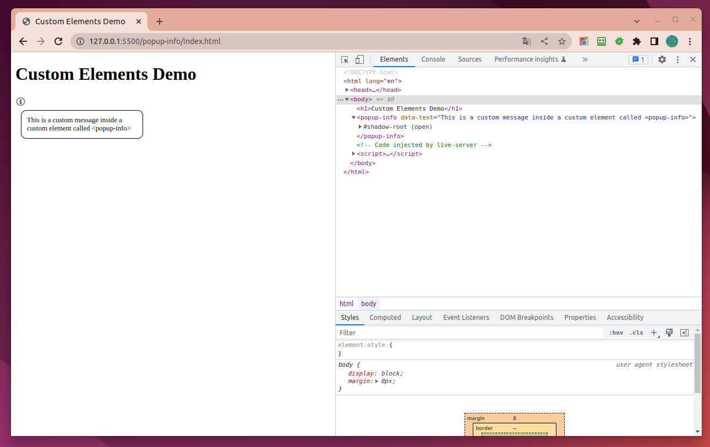

# Web Components

Web Components is a suite of different technologies allowing you to create reusable custom elements — with their functionality encapsulated away from the rest of your code — and utilize them in your web apps.

https://developer.mozilla.org/en-US/docs/Web/Web_Components

# Custom Elementes API

CustomElementRegistry

```
.define()
.get()
.upgrade()
.whenDefined()
```

# First Custom Element



See the source in 'popup-info' folder.

# Libraries

https://www.fast.design/docs/fast-element/getting-started/

https://snuggsi.com/

https://x-tag.github.io/

https://slimjs.com/#/welcome

https://lit.dev/

https://www.htmlelements.com/