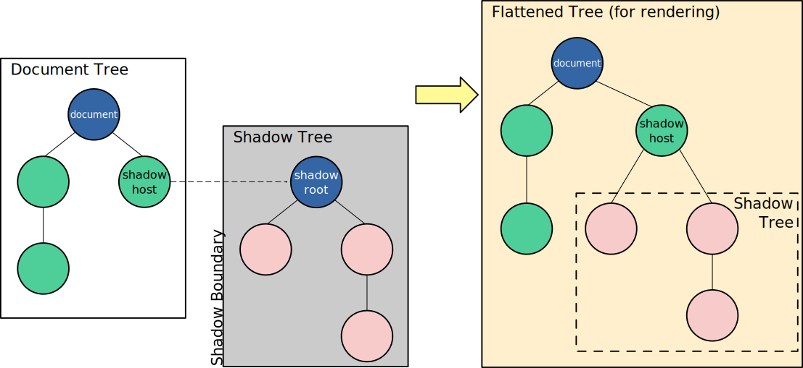

# Web Components

Web Components is a suite of different technologies allowing you to create reusable custom elements — with their functionality encapsulated away from the rest of your code — and utilize them in your web apps.

https://developer.mozilla.org/en-US/docs/Web/Web_Components

# Custom Elementes API

CustomElementRegistry

```
.define()
.get()
.upgrade()
.whenDefined()
```

# First Custom Element


See the source in 'popup-info' folder.

# Libraries

https://www.fast.design/docs/fast-element/getting-started/

https://snuggsi.com/

https://x-tag.github.io/

https://slimjs.com/#/welcome

https://lit.dev/

https://www.htmlelements.com/

# Shadow DOM

Shadow DOM allows hidden DOM trees to be attached to elements in the regular DOM tree — this shadow DOM tree starts with a shadow root, underneath which you can attach any element, in the same way as the normal DOM.




# Self Contained

## Authoring self-contained components in vanilla JavaScript

https://web.dev/shadowdom-v1/


See the source in 'fancy-tabs' folder.

## No Shadows

Some elements cannot attach a shadow to themselves.

https://dom.spec.whatwg.org/#dom-element-attachshadow


# Read More

https://glazkov.com/2011/01/14/what-the-heck-is-shadow-dom/

# Light DOM

Light DOM: The markup a user of your component writes. 
```
<better-button>
    <!-- the image and span are better-button's light DOM -->
    
    <span>Settings</span>
</better-button>
```

Shadow DOM: The DOM a component author writes
```
#shadow-root
    <style>...</style>
    <slot name="icon"></slot>
    <span id="wrapper">
    <slot>Button</slot>
    </span>
```

Flattened DOM Tree: Final Product
```
<better-button>
    #shadow-root
    <style>...</style>
    <slot name="icon">
        
    </slot>
    <span id="wrapper">
        <slot>
        <span>Settings</span>
        </slot>
    </span>
</better-button>
```

# Shadows with Holes, How’s that for a Mind-bender?

## What happens when you add a child to an element with a shadow DOM subtree


## I see the light!

```
<body>

    <div id="element"></div>

    <script>
        // WARNING: Pseudocode, not a real API.
        var element = document.getElementById('element');

        // Create a shadow subtree.
        let shadowRoot = element.attachShadow({ mode: 'closed' });
        shadowRoot.innerHTML = '<h1>Think of the Children</h1><div class="children">children-go-here</div>';

        // Now add some children.
        var test = element.appendChild(document.createElement('p'));
        test.textContent = 'I see the light!';
    </script>
    
</body>
```


# Conclusion

For the first time ever, we have an API primitive that does proper CSS scoping, DOM scoping, and has true composition. Combined with other web component APIs like custom elements, shadow DOM provides a way to author truly encapsulated components without hacks or using older baggage like iframes.

Don't get me wrong. Shadow DOM is certainly a complex beast! But it's a beast worth learning. Spend some time with it.
